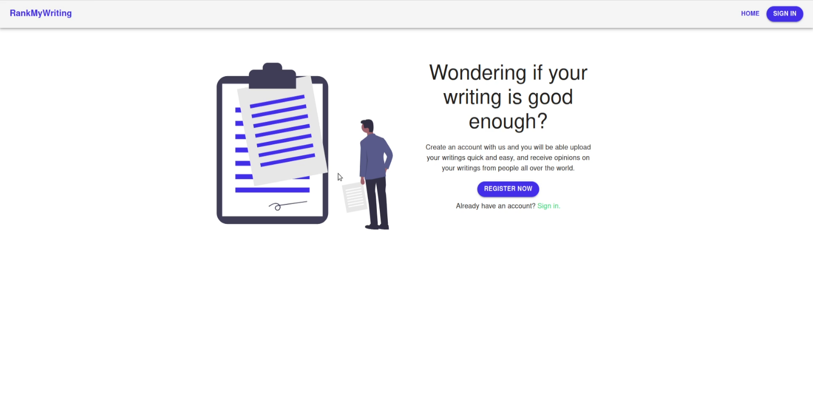
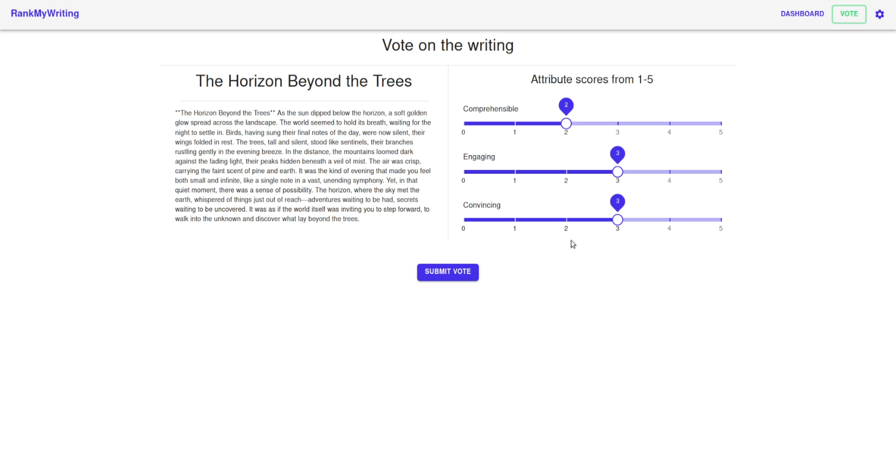

# RankMyWriting - Frontend

RankMyWriting is a web app where users can upload their writings, receive votes and scores on them, and also vote on other people's writings. It's similar to **Photofeeler**, but for texts instead of photos. This repository contains the **frontend** part of the application, built using **JavaScript** and **React**.

For a quick overview of how the app works, check out this [video demo](https://youtu.be/Owe9Kdfzhw8).




## Features

- **Upload Writings**: Users can upload their written texts.
- **Voting**: Users can vote on other people's writings and get feedback.
- **Scores**: Writings are scored based on user votes.

## Requirements

- Node.js version: **v16.20.2**
  - This app is developed to work with Node.js version `v16.20.2`. It may not work properly with newer versions of Node.js due to potential compatibility issues.

## Installation

1. Clone the repository:

   ```bash
   git clone https://github.com/adevk/RankMyWriting-Frontend.git
   cd RankMyWriting-Frontend
2. Install dependencies:

	```bash
	npm install

## Running the App

To start the development server, use the following command:

	npm run start
	
This will launch the app locally. You can open it in your browser at `http://localhost:3000`

## Development Notes

-   This project is built with **React** and **JavaScript**.
-   Ensure you're using Node.js **v16.20.2** to avoid issues with newer versions of Node.
